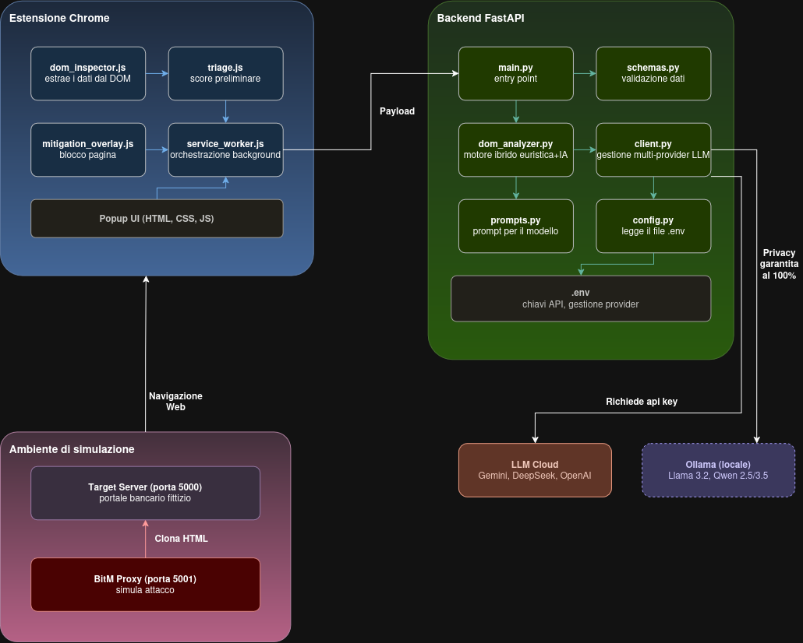

# 🛡️ BitM Sentinel (v2.0) - Real-Time AI Defense System

> **Progetto tesi:** *Rilevamento e mitigazione in tempo reale di attacchi Browser-in-the-Middle (BitM / CAPEC-701) tramite Large Language Models.*

---

## 📌 Cos'è BitM Sentinel?

**BitM Sentinel** è un sistema di sicurezza proattivo progettato per rilevare e bloccare in tempo reale gli attacchi di tipo **Browser-in-the-Middle (BitM)** e **Adversary-in-the-Middle (AitM)**.

I tradizionali sistemi difensivi di rete (firewall, proxy e filtri DNS) non riescono a bloccare questi attacchi perché sono "ciechi" davanti al traffico cifrato HTTPS e non possono vedere il DOM dinamico generato a runtime dal browser.  
**BitM Sentinel risolve questo limite** operando direttamente all'interno del contesto di esecuzione del browser tramite un'architettura cooperativa distribuita a più livelli.

---

## 🏗️ Architettura e Fasi di Funzionamento

<p align="center">
  
</p>

Il sistema opera attraverso **3 livelli sequenziali e complementari**:

### 1️⃣ Livello 1: Sonda Client-Side (Estensione Chrome Manifest V3)
* **Triage Rapido (`triage.js`):** esegue un'analisi euristica istantanea (<5ms) per verificare typosquatting (Levenshtein), iframe nascosti e flussi streaming anomali.
* **Ispezione del DOM (`dom_inspector.js`):** estrae la struttura reale della pagina (form, action, metodi, script esterni, snippet di testo) e registra un listener `submit` in fase di cattura (`capture: true`).
* **Mitigazione Attiva (`mitigation_overlay.js`):** se il rischio è critico (Score ≥ 75 / BLOCK), disabilita istantaneamente tutti i campi (`disabled = true`), intercetta ed annulla l'invio HTTP (`e.preventDefault()`) e mostra l'overlay rosso di blocco a schermo intero.

### 2️⃣ Livello 2: Backend Decisionale (Python FastAPI)
* **Caching in RAM (MD5 Hash):** confronta l'hash del payload: per URL già analizzati abbatte la latenza a **<5 millisecondi** (-99.9%).
* **Validazione Rigida (Pydantic v2):** tipizza e valida i dati in ingresso/uscita (DTO) per garantire stabilità contro payload malformati.
* **Decisione Fail-Safe (`dom_analyzer.py`):** unisce lo score euristico server e la valutazione dell'IA tramite la logica conservativa `final_score = max(heuristic, llm)`.

### 3️⃣ Livello 3: Reasoning Engine (LLM Multi-Provider)
* Valuta la semantica contestuale, la coerenza del brand e le discrepanze di dominio.
* **Supporto Multi-Provider configurabile:**
  * **Google Gemini (`gemini-3.7-flash`, `gemini-3.6-flash`, `gemini-3.5-flash`):** inferenza cloud ultra-rapida con Structured Outputs schema-enforced.
  * **DeepSeek-Reasoner (`deepseek-reasoner` / R1 Cloud):** estrazione automatica del JSON con isolamento del blocco di ragionamento `<think>`.
  * **Ollama Locale (`Llama 3.2 3B` / `Qwen 2.5`):** esecuzione offline e privata su CPU/GPU per ambienti isolati.

---

## 🌐 Supporto Vettori di Attacco: Reverse Proxy & WebRTC Streaming

BitM Sentinel v2.0 è in grado di neutralizzare **entrambe le grandi famiglie di attacchi BitM (CAPEC-701)**:

1. **Reverse Proxy HTTP Dinamico (stile Evilginx / Modlishka):**
   * L'attaccante modifica al volo l'attributo `action` della form.
   * *Rilevamento:* BitM Sentinel intercetta il *Form Action Mismatch* (es. form servita su `localhost:5001` che tenta di inviare credenziali a un endpoint terzo malevolo) e blocca l'evento `submit`.

2. **Remote Browser Streaming & WebRTC (stile Cuddlephish / noVNC):**
   * L'attaccante proietta uno streaming video a tutto schermo (`<video playsinline style="width: 100vw">` o `<canvas>`) e usa un keylogger JavaScript via WebSocket per rubare tasti premuti e mouse.
   * *Rilevamento:* BitM Sentinel rileva la presenza di elementi video/canvas a tutto schermo in assenza di form HTML nativi su IP o domini che dichiarano titoli bancari/sensibili, classificando la minaccia con **Score 95 (BLOCK / BITM_PROXY)**.

---

## 🚀 Guida all'Installazione e Avvio dei Server

### 1. Requisiti di Sistema
* **Python 3.10+**
* **Google Chrome / Brave / Edge**

---

### 2. Installazione e Avvio del Backend FastAPI

1. Apri un terminale e spostati nella cartella `backend`:
   ```bash
   cd backend
   ```
2. Crea e attiva l'ambiente virtuale Python:
   ```bash
   python3 -m venv venv
   source venv/bin/activate
   ```
3. Installa le dipendenze:
   ```bash
   pip install -r requirements.txt
   ```
4. Configura il file `.env` (puoi copiare da `.env.example`):
   ```ini
   # Per usare Google Gemini (Predefinito):
   LLM_PROVIDER=gemini
   LLM_MODEL=gemini-3.7-flash
   GEMINI_API_KEY=inserisci_la_tua_api_key_qui

   # Oppure per usare DeepSeek:
   #LLM_PROVIDER=openai
   #LLM_MODEL=deepseek-reasoner
   #OPENAI_API_KEY=inserisci_la_tua_api_key_qui

   # Oppure per usare Ollama Locale:
   #LLM_PROVIDER=ollama
   #LLM_MODEL=llama3.2
   ```
5. Avvia il server backend:
   ```bash
   python3 app/main.py
   ```
   *Il server sarà attivo su `http://localhost:8000` con documentazione OpenAPI interattiva su `http://localhost:8000/docs`.*

---

### 3. Installazione dell'Estensione nel Browser

1. Apri Google Chrome e digita nella barra degli indirizzi: `chrome://extensions/`
2. Attiva la levetta **"Modalità sviluppatore"** in alto a destra.
3. Clicca su **"Carica estensione non pacchettizzata"** (*Load unpacked*).
4. Seleziona la cartella `BitmProject/extension`.
5. *(Consigliato per test locali)*: Clicca su "Dettagli" dell'estensione e spunta **"Consenti l'accesso agli URL dei file"**.

---

### 4. Avviare i Server di Simulazione (Test Sperimentale)

Per testare la reazione del sistema di difesa, sono forniti due server di simulazione:

#### A. Portale Bancario Legittimo (Porta 5000)
In un nuovo terminale:
```bash
python3 simulation/target_server/app.py
```
* **Test:** Visita `http://localhost:5000/login` e clicca sull'estensione.
* **Risultato:** `Score: 0/100 (ALLOW)` ➔ Navigazione consentita e icona verde.

#### B. Reverse Proxy Malevolo BitM (Porta 5001)
In un altro terminale:
```bash
python3 simulation/bitm_proxy/app.py
```
* **Test:** Visita `http://localhost:5001/login` e clicca sull'estensione (o prova a fare il submit).
* **Risultato:** `Score: 100/100 (BLOCK)` ➔ Rilevato Form Action Mismatch, input disabilitati e overlay rosso di blocco a schermo intero!

#### C. Remote Streaming BitM (Cuddlephish / WebRTC / noVNC)
* **Test:** Visita la pagina trappola video WebRTC (es. `http://192.168.122.201/` o pagina con canvas/video full viewport).
* **Risultato:** `Score: 92-95/100 (BLOCK)` ➔ Rilevato streaming remoto senza form HTML nativi.

