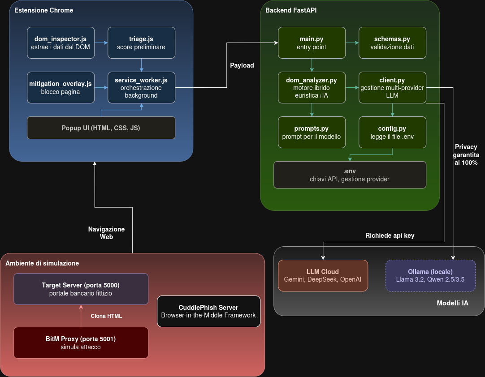

# 🛡️ BitM Sentinel (v2.1.1) - Real-Time AI Defense System

<p align="center">
  
  
  
  
  
</p>

> **Progetto di Tesi Magistrale:** *Rilevamento e mitigazione in tempo reale di attacchi Browser-in-the-Middle (BitM / CAPEC-701) tramite Large Language Models.*

---

## 📑 Indice dei Contenuti
1. [Cos'è BitM Sentinel?](#-cosè-bitm-sentinel)
2. [Architettura del Sistema a 3 Livelli](#️-architettura-del-sistema-a-3-livelli)
3. [Semaforo di Rischio e Metrica dei Verdetti](#-semaforo-di-rischio-e-metrica-dei-verdetti)
4. [Vettori di Attacco Contrastati](#-vettori-di-attacco-contrastati)
5. [Struttura della Repository](#-struttura-della-repository)
6. [Guida all'Installazione e Avvio](#-guida-allinstallazione-e-avvio)
   * [Requisiti di Sistema](#1-requisiti-di-sistema)
   * [Setup del Backend FastAPI](#2-installazione-e-avvio-del-backend-fastapi)
   * [Setup dell'Estensione nel Browser](#3-installazione-dellestensione-nel-browser)
7. [Scenari di Simulazione e Test Pratici](#-scenari-di-simulazione-e-test-pratici)
8. [Esecuzione dei Test Automatizzati](#-esecuzione-dei-test-automatizzati)
9. [Riferimenti Normativi, Standard & Ricerca Scientifica](#-riferimenti-normativi-standard--ricerca-scientifica)

---

## 📌 Cos'è BitM Sentinel?

**BitM Sentinel** è un framework di sicurezza proattivo progettato per rilevare e bloccare in tempo reale gli attacchi avanzati di phishing basati su **Browser-in-the-Middle (BitM / CAPEC-701)** e **Adversary-in-the-Middle (AiTM)**.

I sistemi difensivi tradizionali basati sulla rete (firewall perimetrali, Secure Web Gateway, filtri DNS e proxy aziendali) falliscono sistematicamente contro queste minacce per due motivi strutturali:
1. **Canale Cifrato End-to-End:** Il traffico HTTPS tra il browser della vittima e il server di phishing è cifrato con certificati TLS validi (es. emessi automaticamente da Let's Encrypt), rendendo il contenuto opaco a qualsiasi ispezione di rete non invasiva.
2. **Dinamicità del DOM a Runtime:** I form di login, le manipolazioni delle URL e le iniezioni di script vengono generati dinamicamente nel client tramite JavaScript all'interno del browser.

**BitM Sentinel risolve questo limite operando direttamente nel contesto di esecuzione del browser** attraverso un'architettura ibrida distribuita che unisce una sonda client-side a bassissima latenza con un motore di reasoning semantico alimentato da Large Language Models (LLM).

---

## 🏗️ Architettura del Sistema a 3 Livelli

<p align="center">
  
</p>

Il sistema opera attraverso **3 livelli sequenziali e cooperativi**:

### 1️⃣ Livello 1: Sonda Client-Side (Estensione Chrome Manifest V3)
* **Triage Rapido (`content/triage.js`):** Esegue un'analisi euristica istantanea (**< 5 ms**) per verificare typosquatting (distanza di Levenshtein applicata a brand sensibili), pattern di sottodomini proxati in stile Evilginx, form non sicuri che trasmettono credenziali via HTTP GET (**CWE-598**), iframe nascosti (anti-clickjacking) e flussi streaming WebRTC/canvas in contesti sensibili.
* **Ispezione Sincrona (`content/dom_inspector.js`):** Estrae i metadati strutturali del DOM (form, action, metodi di trasmissione, script esterni, snippet di testo visibile). Intercetta e congela in modo **rigorosamente sincrono** l'evento `submit` della pagina, azzerando qualsiasi potenziale race condition prima che le credenziali lascino il browser.
* **Mitigazione Attiva Anti-XSS (`content/mitigation_overlay.js`):** In caso di rischio critico (**Score ≥ 75 / BLOCK**), inietta direttamente nel DOM una modale bloccante a tutto schermo con stili inline ad altissimo z-index (`!important`), disabilita selettivamente solo i campi attivi tramite `data-bitm-disabled` e visualizza la motivazione tramite proprietà sicure `textContent` (eliminando alla radice vettori di DOM-XSS da prompt injection).
* **Service Worker Asincrono (`background/service_worker.js`):** Fa da broker di messaggi asincrono, gestisce le richieste HTTP con timeout a 60 secondi tramite `AbortController`, aggiorna dinamicamente il badge visivo dell'icona dell'estensione e implementa una politica di *fail-safe* locale qualora il backend sia momentaneamente irraggiungibile.

### 2️⃣ Livello 2: Backend Decisionale (Python 3.10+ FastAPI & Uvicorn)
* **Sicurezza di Rete Loopback:** Bind rigoroso su `127.0.0.1` e policy CORS controllata che autorizza esclusivamente le estensioni Chrome autorizzate (`chrome-extension://*`) e gli host di simulazione locali.
* **Caching Deterministico con Eviction:** Memorizza l'impronta crittografica MD5 del payload DOM, abbattendo la latenza a **~1 ms** sulle visite ripetute alla stessa pagina, con tetto massimo FIFO a 200 record per prevenire memory leak in lunghe sessioni di navigazione.
* **Validazione Rigida (Pydantic v2):** Convalida formale degli schemi `AnalysisRequest` e `AnalysisResponse` e configurazione centralizzata via `pydantic-settings`.
* **Decision Engine Fail-Safe (`app/analyzers/dom_analyzer.py`):** Unisce il risultato delle euristiche server-side (Fast-Path) con il verdetto semantico dell'LLM (Slow-Path) tramite la formula prudenziale:
  $$\text{Final Score} = \max(\text{Score}_{\text{heuristic}}, \text{Score}_{\text{llm}})$$
  garantendo l'azzeramento dei falsi negativi dovuti a eventuali allucinazioni del modello.

### 3️⃣ Livello 3: Reasoning Engine (LLM Multi-Provider)
* Valuta la coerenza del brand, la discrepanza semantica tra il contesto visivo e l'effettivo destinatario dei dati, e smaschera tentativi di obfuscation non rilevabili da regole statiche.
* **Supporto Multi-Provider configurabile a caldo nel file `.env`:**
  * **Google Gemini (`gemini-3.5-flash`, `gemini-3.5-flash-lite`):** Inferenza cloud ultra-rapida con Structured Outputs nativi conformi allo schema JSON Pydantic.
  * **DeepSeek (`deepseek-reasoner` / R1 Cloud):** Modello di ragionamento con estrazione resiliente del JSON e rimozione preventiva dei tag `<think>...</think>`.
  * **OpenAI (`gpt-4o-mini`, `gpt-4o`):** Supporto nativo per Structured Outputs Pydantic.
  * **Ollama Locale (`llama3.2:3b`, `qwen2.5:7b`):** Esecuzione completamente offline e locale per ambienti con requisiti stringenti di privacy e confidenzialità dei dati di navigazione.

---

## 🚦 Semaforo di Rischio e Metrica dei Verdetti

BitM Sentinel adotta una scala di rischio standardizzata normalizzata tra $0$ e $100$, suddivisa in **tre livelli decisionali** sincronizzati tra estensione e backend:

| Livello | Range Score | Stato Azione | Colore Badge | Comportamento del Sistema |
| :---: | :---: | :---: | :---: | :--- |
| 🟢 | **0 – 39** | `ALLOW` | Verde (`OK`) | **Navigazione consentita:** Nessuna anomalia strutturale o semantica rilevata. La sessione prosegue regolarmente. |
| 🟡 | **40 – 74** | `WARN` | Giallo (`WARN`) | **Avviso non bloccante:** Rilevata anomalia di conformità (es. credenziali su metodo HTTP GET **CWE-598**, iframe invisibili sospetti). Viene mostrato un banner persistente in alto. |
| 🔴 | **75 – 100** | `BLOCK` | Rosso (`BITM`) | **Blocco preventivo totale:** Attacco BitM/AiTM rilevato. Disabilitazione sincrona degli input, congelamento del submit e modale bloccante a schermo intero. |

---

## 🌐 Vettori di Attacco Contrastati

BitM Sentinel neutralizza **entrambi i principali paradigmi d'attacco moderni**:

### 1. Reverse Proxy HTTP Dinamico (stile Evilginx / Modlishka / Muraena)
* **Meccanismo dell'attaccante:** Il proxy riceve le richieste della vittima, le inoltra al servizio legittimo e riscrive a runtime il DOM per alterare l'attributo `action` della form di login o catturare i cookie di sessione post-MFA.
* **Strategia di rilevamento:** BitM Sentinel identifica la discrepanza tra l'origine del documento e la destinazione delle credenziali (*Form Action Mismatch*) e la presenza di subdomini proxati spoofati, bloccando l'invio prima dell'esfiltrazione.

### 2. Browser-in-the-Middle (CAPEC-701) & Remote Browser Streaming (stile Cuddlephish / noVNC)
* **Meccanismo dell'attaccante:** L'attaccante avvia un browser virtualizzato sul proprio server e ne proietta il rendering video interattivo alla vittima tramite **WebRTC MediaStream** o **noVNC/WebSocket**, catturando i movimenti del mouse e i tasti digitati. Nel browser della vittima **non esistono form HTML tradizionali**, rendendo inefficaci i filtri euristici classici.
* **Strategia di rilevamento:** BitM Sentinel controlla la presenza di elementi multimediali `<video>` o `<canvas>` a tutto schermo ($\text{isFullWidth} \ge 85\% \land \text{isFullHeight} \ge 70\%$) in assenza di form nativi, in associazione a titoli bancari/di login o indirizzi IP nudi non cifrati, classificando la sessione come **Score 85–95 (BLOCK / `BITM_STREAMING`)**.

---

## 📂 Struttura della Repository

```text
BitmProject/
├── backend/                              # Motore di Analisi FastAPI & AI Engine
│   ├── app/
│   │   ├── analyzers/
│   │   │   └── dom_analyzer.py           # Regole Fast-Path & Fusione Fail-Safe
│   │   ├── api/
│   │   │   └── schemas.py                # Modelli di validazione Pydantic v2
│   │   ├── llm/
│   │   │   ├── client.py                 # Client Multi-Provider LLM & Cache MD5
│   │   │   └── prompts.py                # System Prompt & Threat Intelligence Rules
│   │   ├── config.py                     # Singleton Pydantic Settings
│   │   └── main.py                       # Applicazione FastAPI & Middleware CORS
│   ├── .env.example                      # Template per le variabili d'ambiente
│   ├── requirements.txt                  # Dipendenze Python del backend
│   └── test_full_suite.py                # Test di regressione unitari (9/9 passati)
│
├── extension/                            # Estensione Chrome (Manifest V3)
│   ├── assets/                           # Icone grafiche dell'estensione
│   ├── background/
│   │   └── service_worker.js             # Ciclo di vita estensione e chiamate HTTP
│   ├── content/
│   │   ├── dom_inspector.js              # Estrazione DOM e submit interception
│   │   ├── mitigation_overlay.js         # Overlay modale anti-XSS e input freezer
│   │   └── triage.js                     # Euristica sincrona sub-5ms (Levenshtein)
│   ├── popup/                            # Interfaccia grafica di controllo (HTML/CSS/JS)
│   ├── manifest.json                     # Descrittore Manifest V3
│   └── test_suite.js                     # Test unitari client-side Node.js (5/5 passati)
│
├── simulation/                           # Laboratorio di Simulazione Attacchi
│   ├── bitm_proxy/
│   │   └── app.py                        # Reverse Proxy malevolo simulato (porta 5001)
│   ├── target_server/
│   │   └── app.py                        # Portale bancario legittimo (porta 5000)
│   └── test_giallo.html                  # Scenario vulnerabilità CWE-598 (WARN)
│
├── bitm_sentinel_architettura.png        # Schema architetturale del sistema
└── README.md                             # Documentazione generale del progetto
```

---

## 🚀 Guida all'Installazione e Avvio

### 1. Requisiti di Sistema
* **Python 3.10 o superiore** (consigliato Python 3.12)
* **Node.js v18+** (per l'esecuzione della test suite dell'estensione)
* **Google Chrome / Chromium / Brave / Edge**

---

### 2. Installazione e Avvio del Backend FastAPI

1. Apri un terminale e posizionati nella cartella del progetto:
   ```bash
   cd /home/giale/Scrivania/BitmProject/backend
   ```
2. Crea e attiva l'ambiente virtuale dedicato:
   ```bash
   python3 -m venv venv
   source venv/bin/activate
   ```
3. Installa le dipendenze Python:
   ```bash
   pip install -r requirements.txt
   ```
4. Configura il file `.env` copiando dal template:
   ```bash
   cp .env.example .env
   ```
   Modifica `.env` impostando il provider e le chiavi desiderate:
   ```ini
   LLM_PROVIDER=gemini
   LLM_MODEL=gemini-1.5-flash
   GEMINI_API_KEY=la_tua_api_key_qui
   HOST=127.0.0.1
   PORT=8000
   ```
5. Avvia il server backend:
   ```bash
   python3 app/main.py
   ```
   *Il server sarà attivo su `http://127.0.0.1:8000` con documentazione interattiva Swagger su `http://127.0.0.1:8000/docs`.*

---

### 3. Installazione dell'Estensione nel Browser

1. Apri Google Chrome e naviga su: `chrome://extensions/`
2. Abilita la **"Modalità sviluppatore"** tramite lo switch in alto a destra.
3. Clicca sul pulsante **"Carica estensione non pacchettizzata"** (*Load unpacked*).
4. Seleziona la cartella **`BitmProject/extension`** (assicurati di selezionare la sottocartella `extension/` dove risiede `manifest.json`).
5. *(Consigliato per test con file locali)*: Nella scheda dell'estensione, clicca su **Dettagli** e attiva l'opzione **"Consenti l'accesso agli URL dei file"**.

---

## 🧪 Scenari di Simulazione e Test Pratici

Puoi verificare l'efficacia di BitM Sentinel avviando i server di simulazione inclusi nel repository:

#### A. Portale Bancario Legittimo (Porta 5000)
In un nuovo terminale:
```bash
python3 simulation/target_server/app.py
```
* **Azione:** Visita `http://localhost:5000/login` e inserisci le credenziali.
* **Risultato Atteso:** `Score: 0/100 (ALLOW)` ➔ Badge verde **OK**, navigazione autorizzata.

#### B. Attacco Reverse Proxy BitM (Porta 5001)
In un ulteriore terminale:
```bash
python3 simulation/bitm_proxy/app.py
```
* **Azione:** Visita `http://localhost:5001/login` e prova a inviare il form di login.
* **Risultato Atteso:** `Score: 95/100 (BLOCK)` ➔ Invio bloccato istantaneamente, input disabilitati e modale rossa di allarme.

#### C. Attacco Remote Streaming BitM (Cuddlephish / WebRTC / noVNC)
* **Azione:** Visita un portale di desktop streaming su host o macchina virtuale (es. `http://192.168.122.201/`).
* **Risultato Atteso:** `Score: 85-95/100 (BLOCK)` ➔ Identificata canvas/video a tutto schermo senza form nativi (`BITM_STREAMING`).

#### D. Verifica Vulnerabilità Metodo GET (CWE-598)
* **Azione:** Apri nel browser la pagina locale `simulation/test_giallo.html`.
* **Risultato Atteso:** `Score: 40-55/100 (WARN)` ➔ Rilevate credenziali trasmesse in chiaro su query string; compare il banner giallo/arancione di avvertimento non bloccante.

---

## 🔬 Esecuzione dei Test Automatizzati

Il progetto include due suite di test automatici indipendenti per validare la regressione:

### 1. Test Suite Backend (Python `unittest`)
Esegue la validazione su 9 scenari (pagine lecite, CWE-598, proxy mismatch, raw IP, esclusione domini con numeri, streaming BitM, parser JSON tollerante con tag `<think>`, eviction della cache in memoria e configurazione Pydantic).

```bash
# Esecuzione dalla root del repository:
./backend/venv/bin/python backend/test_full_suite.py

# Oppure entrando nella cartella backend:
cd backend && python3 test_full_suite.py
```
*Output atteso: `Ran 9 tests in 0.003s - OK`*

### 2. Test Suite Estensione (Node.js)
Verifica l'algoritmo di Levenshtein, i pattern regex Evilginx a due stadi, l'esenzione di portali video leciti (YouTube/Twitch) e la cattura di Cuddlephish.

```bash
# Esecuzione dalla root del repository:
node extension/test_suite.js

# Oppure entrando nella cartella extension:
cd extension && node test_suite.js
```
*Output atteso: `ALL EXTENSION TESTS PASSED! (5/5) 🎉`*

---

## 📜 Riferimenti Accademici e Normativi
* **MITRE CAPEC-701:** *Browser-in-the-Middle (BitM)* - [capec.mitre.org/data/definitions/701.html](https://capec.mitre.org/data/definitions/701.html)
* **Tommasi, F., Catalano, C., & Taurino, I. (2021/2022):** *Browser-in-the-Middle (BitM) attacks.* Journal of Computer Virology and Hacking Techniques.
* **CWE-598:** *Use of GET Request with Sensitive Query Strings.*
* **W3C WebAuthn / FIDO2 Alliance:** *Cryptographic origin binding limitations against modern AiTM/BitM vectors.*
